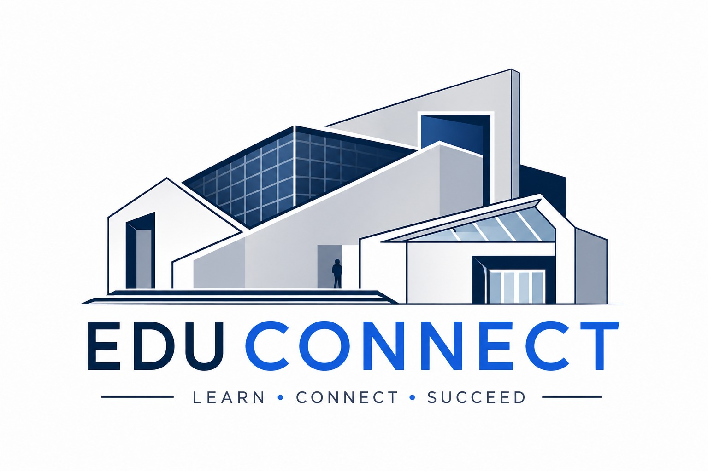

# EduConnect - University Academic Portal 🎓

EduConnect is a comprehensive, fully functional university academic management system built with **Blazor Server** and **.NET**. This project simulates a real-world academic environment, providing a unified platform for Students, Faculty, and Administrators to manage academic lifecycles.



## 🚀 Features

### 🔐 Role-Based Access Control (RBAC)
- **Admin**: Manage students, courses, grading reports, and broadcast announcements.
- **Faculty**: View assigned courses and manage student grades.
- **Student**: Enroll in courses, view grade transcripts, and track academic progress.

### 📚 Academic Management
- **Course Catalog**: Interactive course grid with real-time enrollment status (Open, Almost Full, Full).
- **Enrollment System**: Automated validation for course capacity and credit hour tracking.
- **Grading System**: Dynamic CGPA calculation based on a 4.0 scale with automated letter grade assignment (A, B, C, D, F).

### 🔔 Real-Time Notification System
- **Event-Driven Architecture**: Uses C# delegates and events to broadcast notifications.
- **Live Updates**: Real-time alerts for grade postings, enrollment changes, and global announcements.
- **Notification Bell**: Integrated UI component for instant access to the latest alerts.

### 🎨 Premium UI/UX Design
- **Modern Aesthetics**: Glassmorphism design with backdrop blur effects.
- **Responsive Layout**: Fully optimized for mobile and desktop using Bootstrap 5.
- **Dynamic Feedback**: Micro-animations, floating cards, and real-time data binding.

## 🛠️ Technology Stack

- **Framework**: Blazor Server (.NET 8/10)
- **Styling**: Bootstrap 5 + Custom CSS (Glassmorphism & Premium UI)
- **Architecture**: SOLID Principles & Repository Pattern
- **Data Layer**: In-Memory Data Storage (Thread-safe Repository pattern)

## 🏗️ SOLID Principles Applied

This project strictly adheres to the SOLID architectural principles:
- **SRP**: Isolated services for Student, Course, Grade, and Notification management.
- **OCP**: Generic `IRepository<T>` allows for easy entity extension.
- **LSP**: `Person` base class allows seamless substitution of `Student`, `Faculty`, or `Admin`.
- **ISP**: Clean, focused interfaces like `IStudentService` and `IGradeService`.
- **DIP**: Full Dependency Injection in Program.cs and Razor components.

## 🏁 Getting Started

### Prerequisites
- .NET 8.0 SDK or later
- Visual Studio 2022 or VS Code

### Installation & Execution
1. Clone the repository:
   ```bash
   git clone https://github.com/MalikAyaz29/EduConnect-Project.git
   ```
2. Navigate to the project directory:
   ```bash
   cd EduConnect-Project
   ```
3. Run the application:
   ```bash
   dotnet run
   ```
4. Open your browser and navigate to: `http://localhost:5000`

### Default Login Credentials
| Role | Email | Password |
|------|-------|----------|
| **Admin** | `admin@educonnect.com` | `password` |
| **Faculty** | `faculty@educonnect.com` | `password` |
| **Student** | `student@educonnect.com` | `password` |

## 📄 License
This project was developed for academic purposes as part of a .NET development Task.
